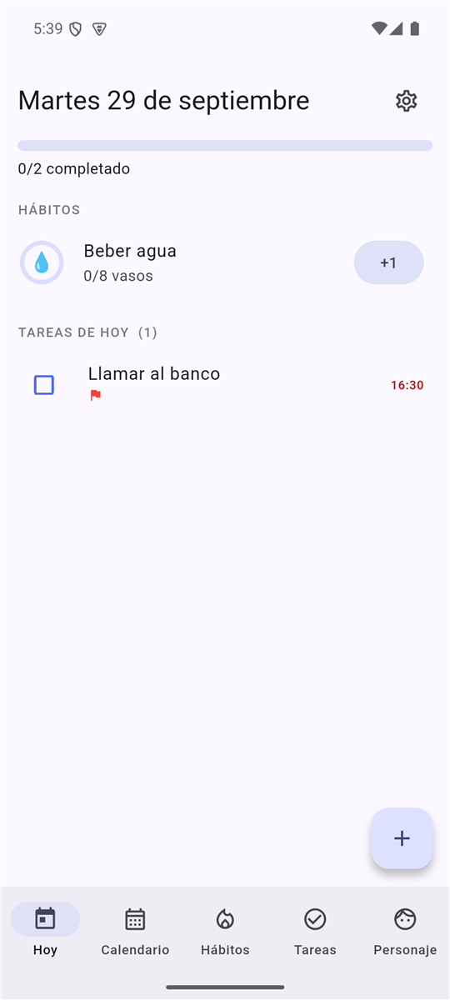
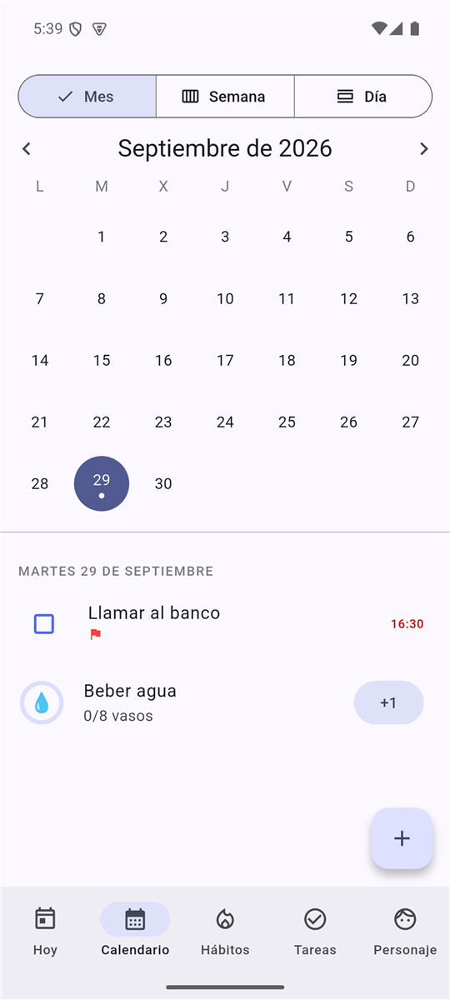
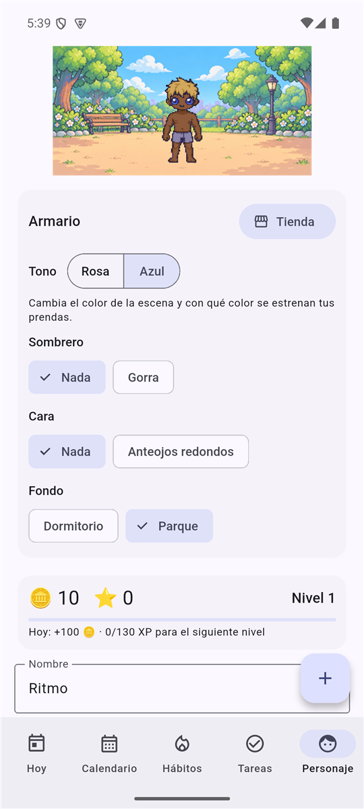
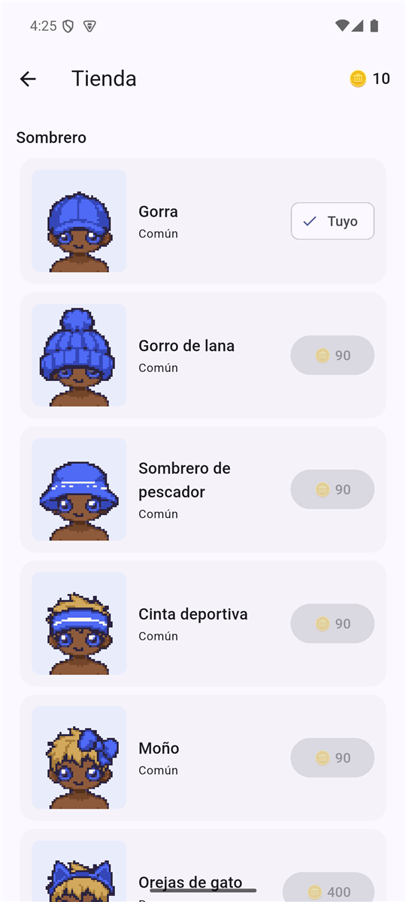

<p align="center">
  
</p>

<h1 align="center">Ritmo</h1>

<p align="center">
  <b>Hábitos, tareas y calendario en una sola app, con un personaje pixel art que crece contigo.</b><br>
  Sin cuenta, sin nube, sin anuncios, sin castigos. Código abierto.
</p>

<p align="center">
  <a href="https://github.com/BenjaminSVG/ritmo/releases/latest/download/ritmo-android.apk"><b>⬇ Descargar para Android</b></a> ·
  <a href="https://github.com/BenjaminSVG/ritmo/releases/latest/download/ritmo-windows.zip"><b>⬇ Descargar para Windows</b></a> ·
  <a href="https://ritmo-pixel.vercel.app">Sitio web</a>
</p>

<p align="center">
  
  
  
</p>

<p align="center">
  
  
  
  
</p>

## ¿Qué es Ritmo?

Ritmo junta tres cosas que suelen estar en apps distintas: **hábitos** (con rachas), **tareas** (con fecha y hora
límite) y un **calendario**. Todo se ve en una pantalla, **Hoy**, y se apunta en un toque o con una frase
("pagar luz mañana 18h #entrega !alta").

Encima hay un juego suave: cada hábito y tarea que completas te da monedas para vestir a tu personaje pixel art.
Si haces ejercicio con constancia, su musculatura crece durante un año. **No hay dinero real, ni castigos, ni
cuentas atrás**: si dejas la app unos días, no pierdes nada.

## Funciones

- **Hoy, Calendario (mes, semana, día), Hábitos, Tareas.** Las tareas se pueden mover arrastrándolas, tienen
  duración y tipo (Tarea, Actividad, Prueba, Entrega, Reunión, Recordatorio) con color propio.
- **Captura rápida en lenguaje natural** (español e inglés): fechas, horas, prioridad, repetición y tipo.
- **Rachas, puntuación y mapa de calor** por hábito; hábitos de sí/no o de cantidad (8 vasos de agua).
- **Recordatorios locales** (Android) para tareas con hora y para hábitos.
- **Cinco widgets de pantalla de inicio en Android:** Hoy, Hábitos, Racha y calendario, Añadir rápido y **Mi personaje**.
- **Tu personaje:** 4 cuerpos, 5 niveles de musculatura, 8 tonos de piel, 24 colores de pelo, 12 de ojos y 9 formas
  de ojos. La musculatura sube sola con los hábitos de la categoría *Ejercicio* (o la eliges tú).
- **Armario y tienda:** más de 30 objetos (sombreros, anteojos, auriculares, camisetas, buzos, pantalones, shorts,
  polleras, vestidos, zapatillas) y 13 fondos de escena, con vista previa sobre tu propio personaje. Casi todo se
  puede teñir con 12 colores; puedes elegir el tono **rosa o azul** de la escena.
- **Economía justa:** hábito +10 🪙, tarea +3, prueba o entrega a tiempo +5, todos los hábitos del día +20; tope de
  150 🪙 al día; el libro de movimientos no se puede duplicar marcando y desmarcando.
- **Tus datos son tuyos:** SQLite local, exportar e importar un respaldo (incluye monedas, compras y personaje).

## Instalar

| Plataforma | Cómo |
|---|---|
| **Android** | Descarga [`ritmo-android.apk`](https://github.com/BenjaminSVG/ritmo/releases/latest/download/ritmo-android.apk) y ábrelo. Android te pedirá permitir instalar apps de esta fuente. |
| **Windows** | Descarga [`ritmo-windows.zip`](https://github.com/BenjaminSVG/ritmo/releases/latest/download/ritmo-windows.zip), descomprímelo y abre `ritmo.exe`. Si SmartScreen avisa, pulsa *Más información → Ejecutar de todas formas* (la app aún no está firmada). |
| **Web** | `flutter run -d chrome` desde `app/` (aún no hay versión alojada). |

> La versión de Android está firmada con una clave de depuración: sirve para probar, no para publicar en Google Play.

## Compilar desde el código

Necesitas [Flutter](https://docs.flutter.dev/get-started/install) 3.47 o superior.

```bash
cd app
flutter pub get
dart run build_runner build --delete-conflicting-outputs   # solo si cambias las tablas de Drift
flutter test                    # más de 45 pruebas
flutter analyze
flutter run -d windows          # o android / chrome
flutter build apk --release     # Android (JAVA_HOME = el JDK de Android Studio)
flutter build windows --release # Windows (Modo desarrollador + Visual Studio Build Tools con C++ y ATL)
```

Simulador de economía (cuánto tarda cada tipo de usuario en conseguir el catálogo):
`dart run tool/simular_economia.dart`.

## Estructura

```
app/            La aplicación Flutter
  lib/domain/     Modelos y reglas puras (rachas, recompensas, musculatura, captura rápida)
  lib/data/       SQLite (Drift), libro de monedas, guardado
  lib/features/   Pantallas (Hoy, Calendario, Hábitos, Tareas, Personaje, Tienda, Ajustes)
  lib/pixel/      Personaje por capas, catálogo de objetos, fondos, recoloreado por código
  lib/platform/   Notificaciones y widgets de Android
  android/        Widgets nativos en Kotlin
docs/           Diseño: producto, UI/UX, arquitectura, gamificación, arte y catálogo
tools/          Scripts (PowerShell) para limpiar y colocar el arte pixel art generado con IA
site/           Sitio web del proyecto (GitHub Pages)
referencias/    Arte limpio y textos de trabajo
```

Las decisiones de diseño están en [docs/](docs/README.md): el personaje y la economía en
[docs/09](docs/09-gamificacion-personaje-pixelart.md), el arte en [docs/10](docs/10-arte-pixelart-prompts-chatgpt.md)
y el catálogo de objetos en [docs/11](docs/11-catalogo-de-objetos.md).

## Estado

Es una versión **0.1**, probada en un emulador de Android (Pixel 7) y compilada para Windows; **no se ha probado
todavía en un teléfono real**. Pendiente: sincronización opcional entre dispositivos, iOS, más peinados, narices y
bocas, estrellas y logros, misiones semanales y temporadas, y verificar en un teléfono real las notificaciones y la
actualización de los widgets. Consulta [docs/README.md](docs/README.md) para el detalle.

## Contribuir

Las ideas y correcciones son bienvenidas: mira [CONTRIBUTING.md](CONTRIBUTING.md).

## Licencia

- **Código:** [MIT](LICENSE).
- **Arte** (personaje, ropa, fondos, logo): [CC BY 4.0](LICENSE-ARTE.md). Parte del arte se generó con ayuda de IA
  y se procesó con las herramientas de `tools/`.
