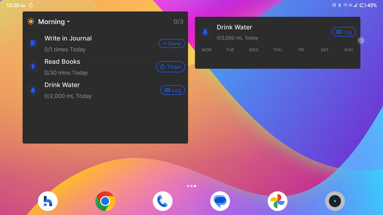
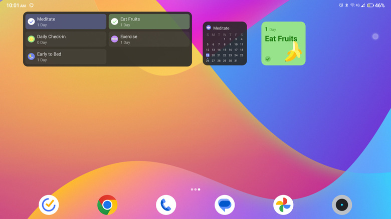
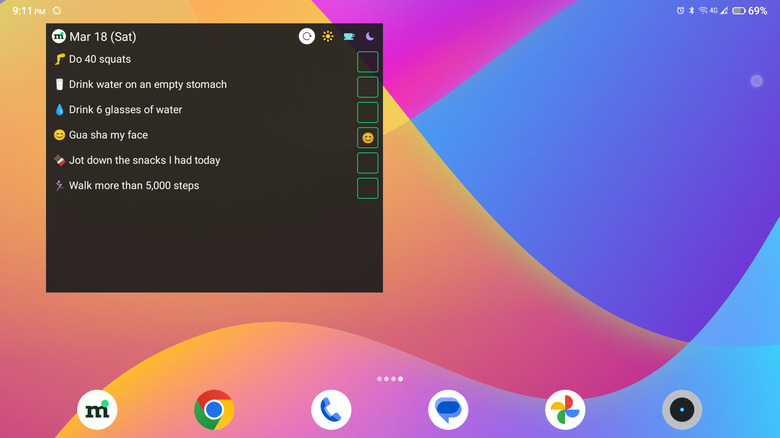
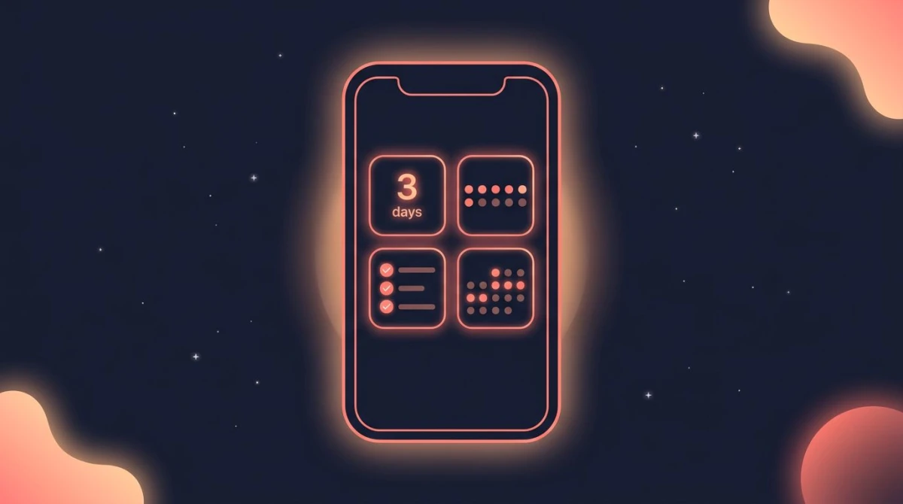
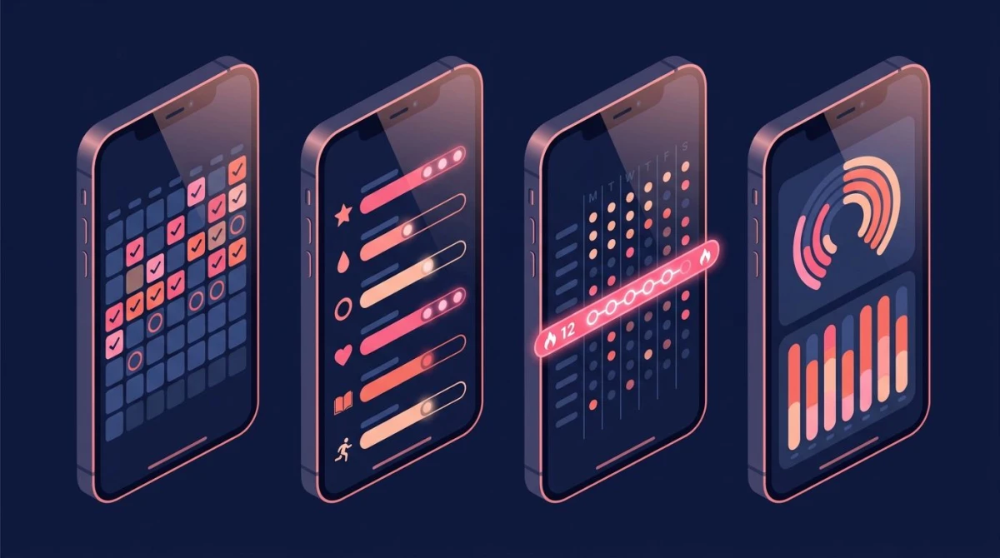

# 8. Referencias de widgets (apps existentes)

> **Nota:** las capturas de otras aplicaciones que ilustraban este documento no se incluyen en el repositorio público, por derechos de autor de sus creadores. Los enlaces a imágenes que aparecen abajo pueden verse rotos; la descripción de cada referencia sigue siendo válida.

Capturas en [../referencias/widgets/](../referencias/widgets/). Igual que las de [02-referencias-ui-ux.md](02-referencias-ui-ux.md): material de estudio interno, propiedad de sus autores, no para usar en la app ni en su marketing. Fuentes al final.

## 8.1 Widgets de hábitos

### Loop Habit Tracker — el más completo (puntuación, gráfico, calendario, botones)

- Cuatro familias: **lista de puntuación** por periodo, **gráfico** de evolución, **calendario de calor** grande (con los días de la semana a la derecha) y **botones de un solo hábito** (cuadrados con anillo: azul = hecho, gris = pendiente).
- Cada widget es de **un solo hábito**; el título es el nombre del hábito.
- Otra vista:  — barras Hoy/Semana/Mes/Trimestre/Año, **anillo de progreso** con el número en el centro y calendario de puntos.

### Habitify — lista por momento del día y hábito único

- Widget "Journal": cabecera con el momento del día (☀ Morning) y contador **0/3**; cada fila con icono, nombre, progreso ("0/2,000 mL Today") y un botón según el tipo (**Done**, **Timer**, **Log**).
- Widget de hábito único: progreso del día y fila con los 7 días de la semana.
- Según las reseñas consultadas, los widgets de Habitify **no son interactivos**: al tocar abren la app.

### TickTick — checklist, calendario mensual y tarjeta

- Lista en **dos columnas** con check circular, nombre y racha ("1 Day"), mini **calendario mensual** de un hábito y **tarjeta cuadrada de color** con la racha y un emoji grande.

### MyRoutine — checklist compacto

- Fecha en la cabecera, una fila por hábito con emoji, y **casilla a la derecha**; iconos de momento del día arriba a la derecha.

### Esquemas de tipos de widget (ilustraciones de HabitBox, no capturas reales)

- Cuatro tipos recurrentes: **racha en número** ("3 days"), **puntos de la semana**, **checklist** y **mini calendario de calor**.

## 8.2 Widgets de tareas — Todoist

- **Lista de tareas**: cabecera con **selector de vista** ("Today ▾"), botón **+** para crear y ajustes ⚙; filas con **círculo** para completar, separadas por líneas finas.
- **Productividad**: contadores diarios/semanales con barras de progreso.
- **Configuración al añadirlo**: elegir vista, tema y tamaño de fuente. Todoist también ofrece un atajo "añadir tarea" (solo el botón).
- Google Tasks ofrece de forma parecida un atajo "Nueva tarea".

## 8.3 Qué adoptamos

| Patrón | Origen | Nuestro widget |
|---|---|---|
| Cabecera con progreso "5/8" y botón **+** | Todoist, Habitify | **Hoy** (ya existe; se le añade el "+") |
| Lista de hábitos con progreso y tipo (cantidad, sí/no) | Habitify | **Hábitos** |
| Calendario de calor + racha de **un** hábito | Loop, TickTick | **Racha y calendario** |
| Botón "+" suelto | Todoist, Google Tasks | **Añadir rápido** |

**Diferencia con las referencias**: Todoist, TickTick y MyRoutine dejan completar desde el widget; nuestros widgets serán **solo lectura** al principio (como los de Habitify): tocar abre la app. Completar desde el widget exige ejecutar código Dart en segundo plano sobre la base de datos y solo lo abordaremos cuando podamos probarlo en un teléfono.

## 8.4 Nuestros widgets en un emulador (Android 35)

Capturas propias, en un emulador y con datos de prueba (un hábito "Beber agua" y una tarea de las 16:30):

- **Hoy**: progreso "0/2", botón "+", hábito con su avance y tarea con hora. Funciona.
- **Hábitos**: progreso "0/1" y "0/8 vasos". Funciona; el widget de 4×3 deja mucho espacio en blanco cuando hay pocos hábitos.
- **Racha y calendario**: la imagen del calendario de calor se genera y se muestra; las celdas están vacías porque aún no hay registros. Habría que probarlo con historial real.
- **Añadir rápido**: no se ha probado visualmente. El mismo enlace interno que usa el "+" de Hoy sí abre "Nueva tarea".
- Hallazgo corregido durante la prueba: los cuatro widgets aparecían en el selector con el mismo nombre ("ritmo"); ahora tienen nombre propio.

## 8.5 Fuentes
- [SlashGear — The Best Android Widgets For Tracking Habits](https://www.slashgear.com/1232500/the-best-android-widgets-for-tracking-habits/) (capturas de MyRoutine, Loop, Habitify y TickTick)
- [HabitBox — Habit Tracker Widget: 6 Best Home Screen Apps](https://habitbox.app/blog/habit-tracker-widget) (esquemas)
- [Todoist — Use a Todoist widget on your Android device](https://www.todoist.com/help/articles/use-a-todoist-widget-on-your-android-device-632pZA)
- [Google Tasks — Add Google Tasks to your home screen](https://support.google.com/tasks/answer/10478781?hl=en&co=GENIE.Platform%3DAndroid) (solo texto; su página no ofreció imágenes descargables)
- [Loop Habit Tracker en Google Play](https://play.google.com/store/apps/details?id=org.isoron.uhabits)
